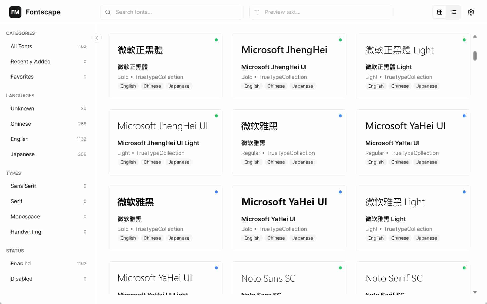
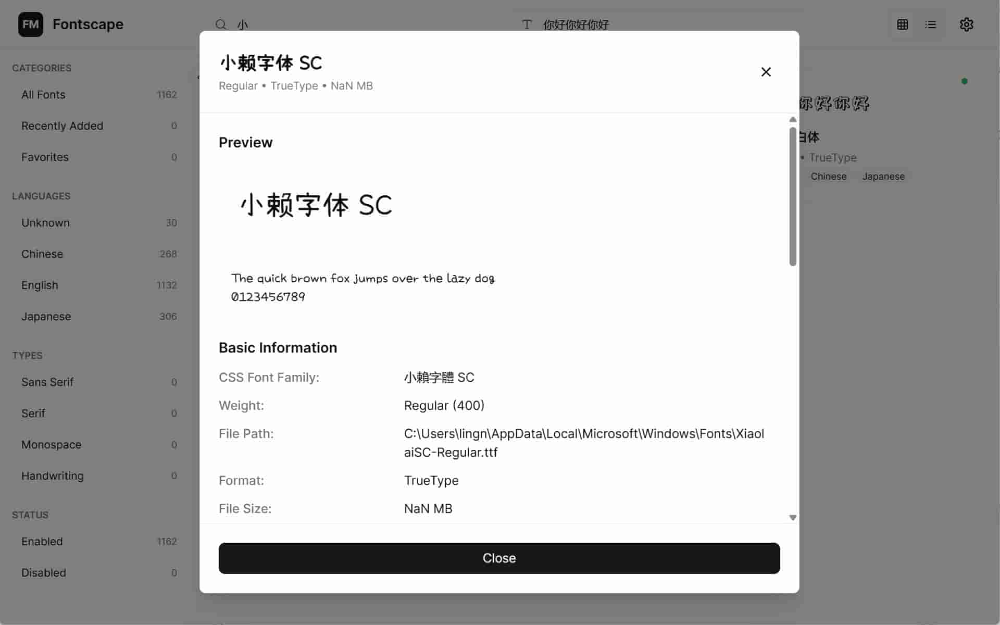

# Fontscape

[English](./README.md)

基于 Tauri 和 React 构建的现代化 Windows 字体浏览、管理工具。

> 此项目还有一堆东西没有开发完，但是对于日常最需要筛选字体够了所以发上来试试

## 为什么做这个

- 能准确按语言筛选字体，基本支持打算完善东亚三国语言。
- 能查看对应的 CSS 变量名

Windows 自带的字体软件对于语言的分类筛选几乎等于不可用。作为中文用户，非常想要一个能真的筛选中文字体的字体浏览器。所以有了这个项目。

另外，网上的字体文件元数据比较混乱，例如部分简体中文字体的 css 字体家族名其实是繁体等等。因此使用浏览器解析的优先级来获取可用的 css font-family name.

## TODO

- [ ] 字体预览，支持自定义字号和预览文本
- [ ] 智能搜索，支持拼音搜索中文字体
- [ ] 按语言和类型分类过滤字体
- [ ] 网格视图和纸张视图两种模式
- [ ] 右键菜单快捷操作
- [ ] 多选模式支持批量操作
- [ ] 使用开放源下载
- [ ] 安装/移除/开关 字体

## 截图




## 技术栈

### 前端
- React 18 + TypeScript
- TailwindCSS + shadcn/ui
- Zustand（状态管理）
- TanStack Virtual（虚拟滚动）
- Vite

### 后端
- Tauri 2.x
- Rust
- Windows API 绑定
- ttf-parser（字体解析）

## 快速开始

### 环境要求
- Node.js 18+
- Rust 1.70+
- Windows 10/11

### 安装步骤

1. 克隆仓库：
```bash
git clone https://github.com/Sansui233/fontscape.git
cd fontscape
```

2. 安装依赖：
```bash
npm install
```

3. 开发模式运行：
```bash
npm run tauri:dev
```

4. 生产环境构建：
```bash
npm run tauri:build
```

## 项目结构

```
fontscape/
├── src/                    # React 前端
│   ├── components/         # UI 组件
│   ├── hooks/              # 自定义 React Hooks
│   ├── store/              # Zustand 状态管理
│   └── lib/                # 工具函数和 API
├── src-tauri/              # Rust 后端
│   └── src/
│       ├── font/           # 字体扫描和解析
│       └── lib.rs          # Tauri 命令
└── claude.md               # 技术架构文档
```

## 开发路线图

- [x] 阶段 1：基础框架搭建
- [x] 阶段 2：字体扫描和解析
- [x] 阶段 3：字体预览
- [x] 阶段 4：搜索功能
- [ ] 阶段 5：字体管理（启用/禁用）
- [ ] 阶段 6：分类和过滤
- [ ] 阶段 7：字体详情页
- [ ] 阶段 8：性能优化
- [ ] 阶段 9：打磨和发布

## 贡献

欢迎贡献代码！请随时提交 Pull Request。

## 许可证

GNU3.0

## 作者

Sansui233